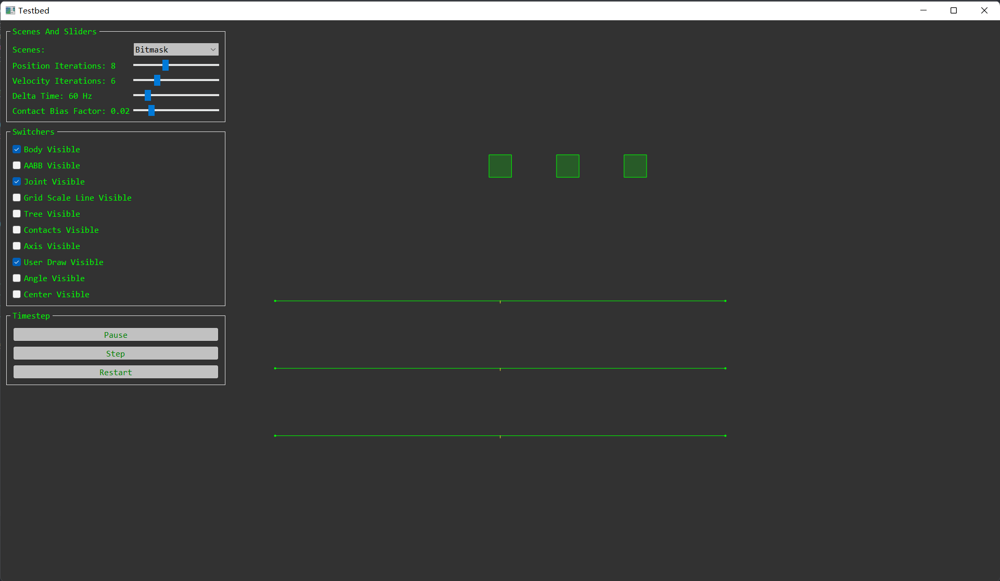
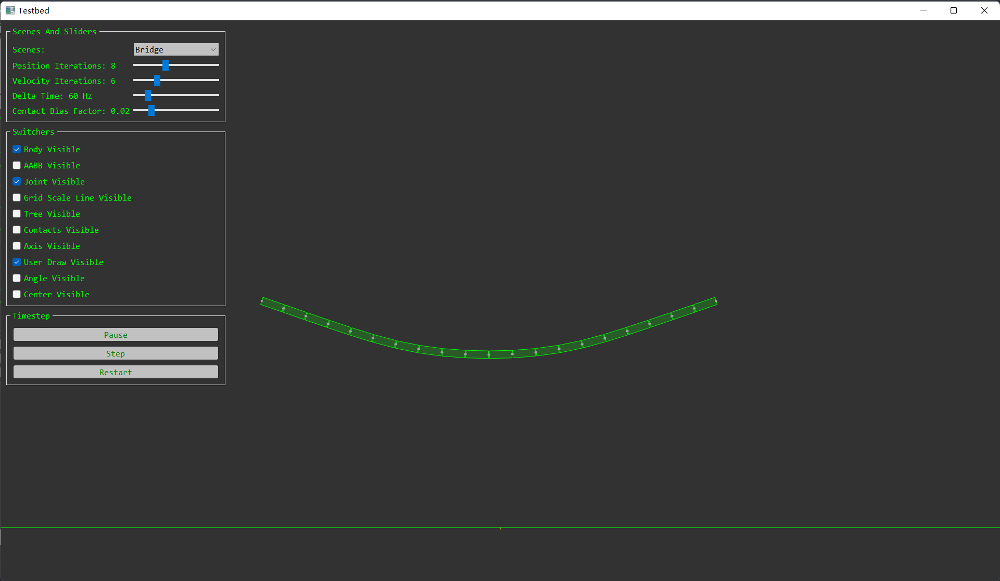
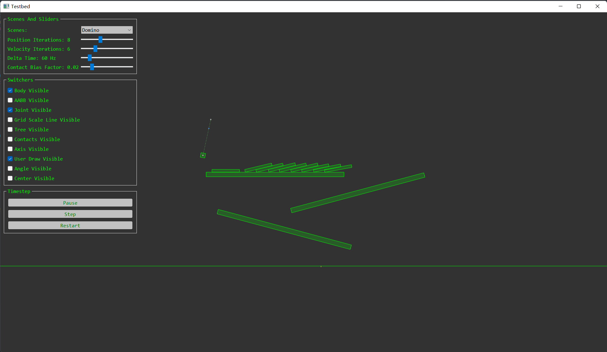
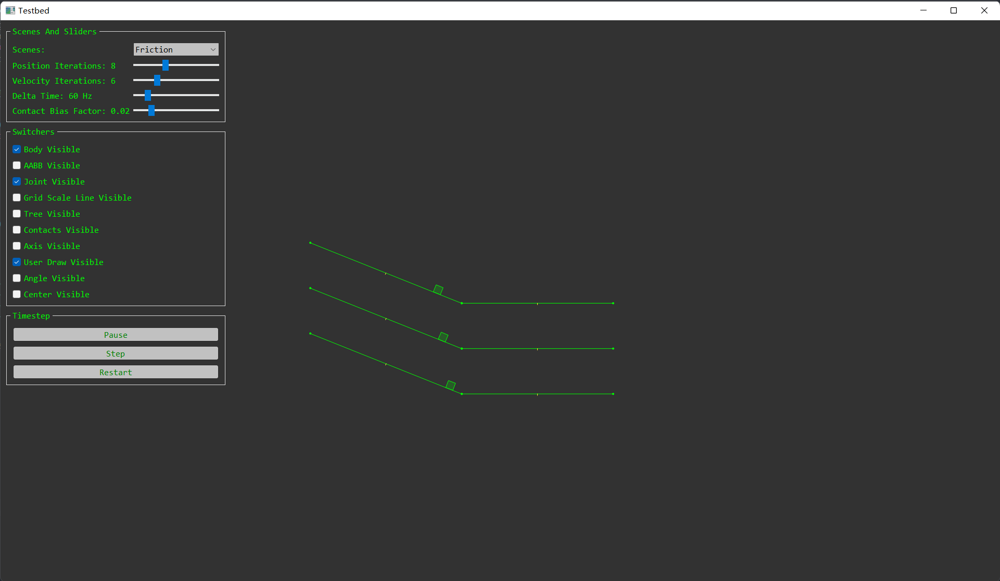
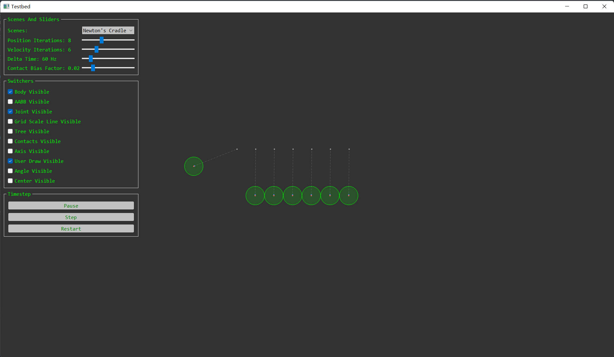
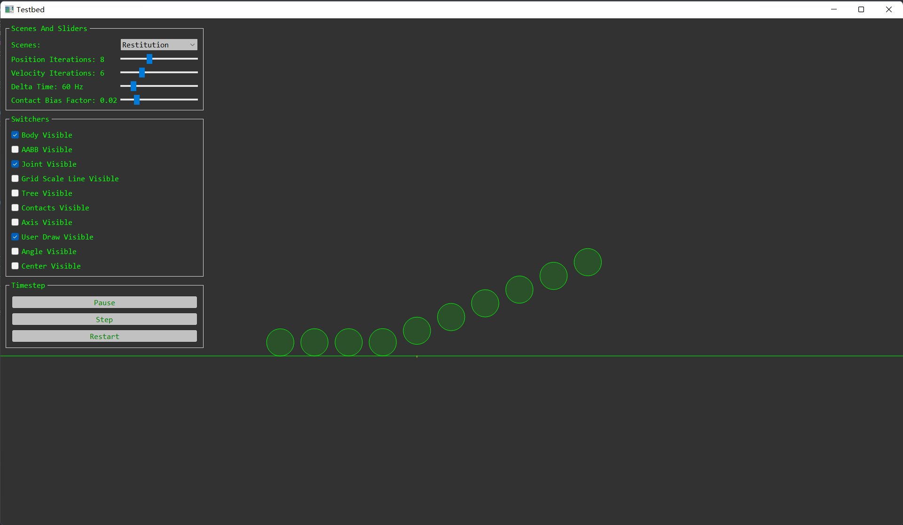
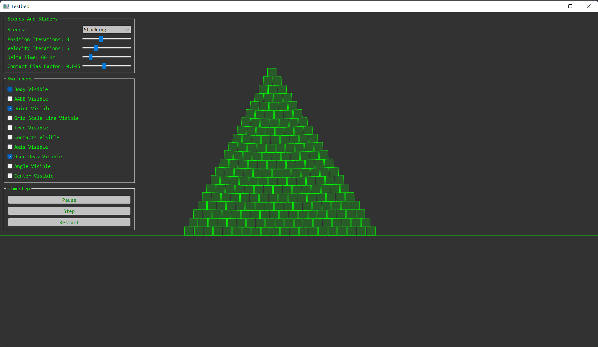
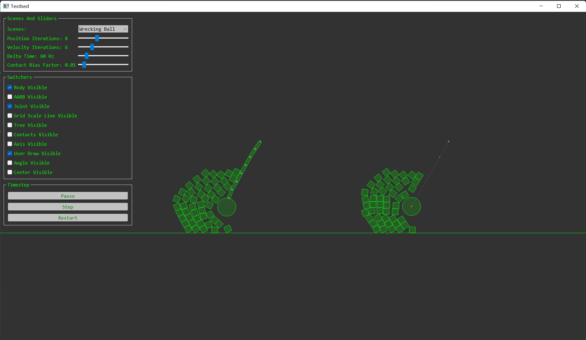

# Physics2D
[中文](README_zh_CN.md)

Simple 2D Physics Engine For Tutoring.

# Build

```
cmake CMakeLists.txt
```

# Requirement
- C++ 17
- vcpkg
  - Qt

# Features
- Basic Linear Algebra
- Collision Detection
  - Narrowphase
    - Algorithm
      - SAT
      - GJK & EPA & MPR & Distance
      - Contact Pair By Sutherland-Hogdman Clipping
    - Continuous Collision Detection
      - Sampling Trajectory of Body
      - Time of Impact
  - Broadphase
    - Axis-Aligned Bounding Box
    - Dynamic Bounding Volume Tree
      - SAH
      - Dynamic Tree & Array
      - Raycast
- Contact Maintainer
- Rigid Body Dynamics Simulation
- Sequential Impulse Solver
- Joint
  - Distance
  - Rotation
  - Point
  - Mouse
- TestBed
- Basic Debug Drawing
  - Rigid Body
  - AABB
  - DBVH
  - Joint
- Basic 2D Camera
  - Zooming
  - Smooth Transition
  - Tracing Specified Body
- Simple 2D Geometry Algorithm
  - Support Mapping
      - Ellipse
      - Circle
      - Polygon
      - Line
      - Point
      - Capsule
      - Sector
  - Intersection
    - Raycast
    - Line Segment
  - Convexity
    - Graham Scan
    - Convexity Test
  - Center
    - Incenter
    - Centroid
    - Circumcenter
  - Circle
    - Circumcircle
    - Inscribed-circle
  - Ellipse
    - Support Mapping
    - Nearest Point

# Future
- Broadphase
  - Uniform Grid
  - Sweep And Prune
- Integrator
  - Verlet
  - Rk4
- Joint
  - Prismatic
  - Weld
- Non-Fit Polygon
- Soft Body
  - Finite Element Method
  - Mass-Spring System
- Rope
  - Position-Based Dynamics

# Screenshot


















# Reference
- [Box2D](https://github.com/erincatto/box2d)
- [Box2D Lite](https://github.com/erincatto/box2d-lite)
- [dyn4j](https://github.com/dyn4j/dyn4j)
- [matterjs](https://github.com/liabru/matter-js)
- [nphysics](https://github.com/dimforge/nphysics)
- [Box2D Publications](https://box2d.org/publications/)
- [dyn4j Official Blog](https://dyn4j.org/blog/)
- [Game Physics For Beginners - liabru](https://brm.io/game-physics-for-beginners/)
- [Allen Chou's Blog](http://allenchou.net/game-physics-series/)
- [Physics Constraints Series - Allen Chou](https://www.youtube.com/c/MingLunChou/videos)
- [Soft Constraints - ODE](https://ode.org/ode-latest-userguide.html#sec_3_8_0)
- [Gaffer's on Games](https://gafferongames.com/#posts)
- [Randy Gaul's Blog](http://www.randygaul.net/)
- [Winter's Dev](https://blog.winter.dev/)
- [Primitives and Intersection Acceleration](https://www.pbr-book.org/3ed-2018/Primitives_and_Intersection_Acceleration/Bounding_Volume_Hierarchies)
- [Real-Time Rendering Intersection](http://www.realtimerendering.com/intersections.html)
- [Inigo Quilez's 2D SDF Functions](https://www.iquilezles.org/www/articles/distfunctions2d/distfunctions2d.htm)
- [*A Simple Time-Corrected Verlet Integration Method* - Jonathan Dummer](https://archive.gamedev.net/archive/reference/programming/features/verlet/)
- [*Introduction to rigid body pipeline, collision detection* - Erwin Coumans](https://docs.google.com/presentation/d/1wGUJ4neOhw5i4pQRfSGtZPE3CIm7MfmqfTp5aJKuFYM/edit#slide=id.g644a5aa5f_1_116)
- *Foundations of Physically Based Modeling and Animation* - Donald House and John C. Keyser
- *Real-Time Collision Detection* by Christer Ericson
- *Game Programming Gems 7* - Scott Jacobs
- *Game Physics Cookbook* - Gabor Szauer
