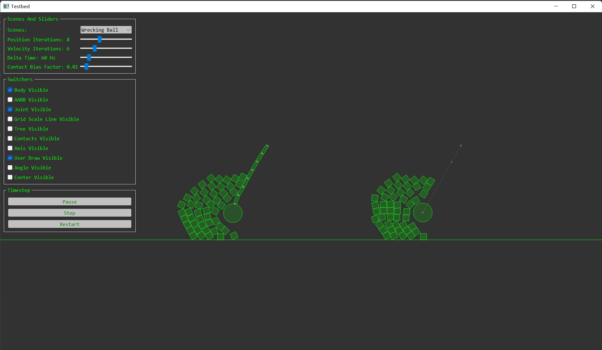

# Physics2D

一个简单、用于博客教学的 2D 游戏物理引擎。
知乎专栏：[ACRL's Development](https://www.zhihu.com/column/c_1262755781494808576)

> 请注意: 如果要尝试效果，请前往 [Physics2D-TestBed-SFML](https://github.com/AngryAccelerated/Physics2D-TestBed-SFML) .

# 快速构建
```
cmake CMakeLists.txt
```

# 编译环境
- C++ 17

# 功能特点
- 基本的线性代数类
- 2D 图元的碰撞检测
  - 精检测阶段（Narrowphase）
    - 检测算法
      - 分离轴算法
      - GJK 算法
      - 多边形扩展算法
      - 闵可夫斯基入口简化
      - Sutherland Hodgman 多边形裁剪
    - 连续碰撞检测
      - 轨迹采样
      - 冲击时间
  - 粗检测阶段
    - 轴对齐包围盒
    - 动态层次包围体树
      - 表面积启发法
      - 光线物体查询
      - 动态树与数组
    - 扫掠减除法
    - 均匀网格法
- 碰撞点维护
- 刚体模拟
- 连续冲力解算器
- 约束关节
  - 鼠标约束
  - 旋转/朝向约束
  - 点约束
  - 距离约束
- 测试 Demo
- 基本 Debug 绘图
- 2D 平滑相机
  - 缩放
  - 平滑移动
  - 跟踪物体
- 基本 2D 计算几何算法
  - 基本图元映射
  - 相交测试
  - 凸体检测
  - 三角形三心计算
  - 外/内接圆
  - 椭圆最近点查询
  
# 计划清单
- 积分器
  - 韦尔莱
  - 四阶龙格库塔法
- 关节约束
  - 结合约束
- 软体模拟
  - 有限元方法
  - 质点弹簧系统
- 绳子模拟
  - 基于位置的动力学

# 运行截图




# 参考
- [Box2D](https://github.com/erincatto/box2d)
- [Box2D Lite](https://github.com/erincatto/box2d-lite)
- [dyn4j](https://github.com/dyn4j/dyn4j)
- [matterjs](https://github.com/liabru/matter-js)
- [nphysics](https://github.com/dimforge/nphysics)
- [Box2D Publications](https://box2d.org/publications/)
- [dyn4j Official Blog](https://dyn4j.org/blog/)
- [Game Physics For Beginners - liabru](https://brm.io/game-physics-for-beginners/)
- [Allen Chou's Blog](http://allenchou.net/game-physics-series/)
- [Physics Constraints Series - Allen Chou](https://www.youtube.com/c/MingLunChou/videos)
- [Soft Constraints - ODE](https://ode.org/ode-latest-userguide.html#sec_3_8_0)
- [Gaffer's on Games](https://gafferongames.com/#posts)
- [Randy Gaul's Blog](http://www.randygaul.net/)
- [Winter's Dev](https://blog.winter.dev/)
- [Primitives and Intersection Acceleration](https://www.pbr-book.org/3ed-2018/Primitives_and_Intersection_Acceleration/Bounding_Volume_Hierarchies)
- [Real-Time Rendering Intersection](http://www.realtimerendering.com/intersections.html)
- [Inigo Quilez's 2D SDF Functions](https://www.iquilezles.org/www/articles/distfunctions2d/distfunctions2d.htm)
- [*A Simple Time-Corrected Verlet Integration Method* - Jonathan Dummer](https://archive.gamedev.net/archive/reference/programming/features/verlet/)
- [*Introduction to rigid body pipeline, collision detection* - Erwin Coumans](https://docs.google.com/presentation/d/1wGUJ4neOhw5i4pQRfSGtZPE3CIm7MfmqfTp5aJKuFYM/edit#slide=id.g644a5aa5f_1_116)
- *Foundations of Physically Based Modeling and Animation* - Donald House and John C. Keyser
- *Real-Time Collision Detection* by Christer Ericson
- *Game Programming Gems 7* - Scott Jacobs
- *Game Physics Cookbook* - Gabor Szauer


